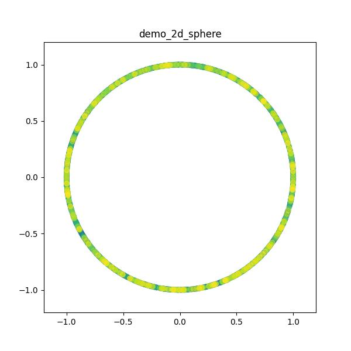
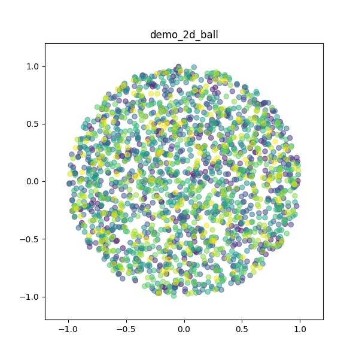
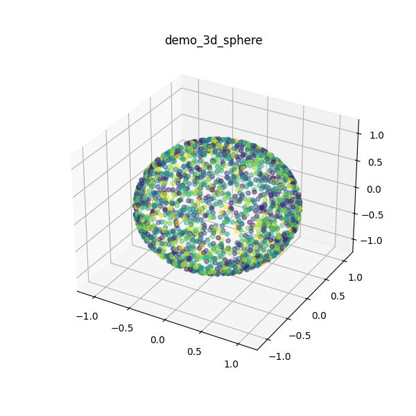
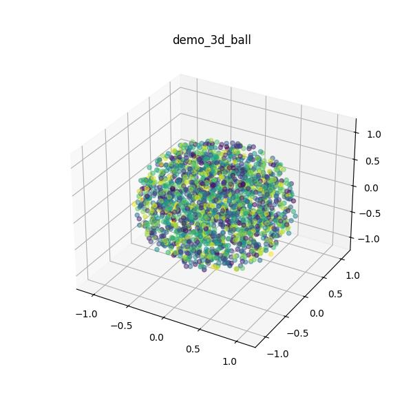

# Random points on sphere or in ball

### Info

Implementation of two functions for obtaining random points on the surface of a sphere and inside a ball.

```random_sphere```

1. Take a random number from the normal (Gaussian) distribution of numbers over the number of dimensions for each point.
2. For each point, calculate the norm (Euclidean) and divide the coordinates by this norm.
3. If necessary, transform the center and radius (semi-axes).

```random_ball```

1. Perform steps 1 and 2 from the previous algorithm.
2. Take a random radius, the probability of which corresponds to the surface area of a ball with this radius in n dimensions. Multiply all points by their radii
4. If necessary, transform the center and radius (semi-axes).

Information taken from the [link](https://translated.turbopages.org/proxy_u/en-ru.ru.589f3296-6552418d-58a6291e-74722d776562/https/stackoverflow.com/questions/54544971/how-to-generate-uniform-random-points-inside-d-dimension-ball-sphere).

---

### Prerequisites

Language version starting from Python 3.10+ and package Numpy


```bash
$ python --version
Python 3.10.4
```

---

### Demo






---

### Authors

* [Dmitry Volkov](https://github.com/d1mav0lk0v)

---

### Link

* [GitHub](https://github.com/d1mav0lk0v/random_hypersphere_hyperball)

---